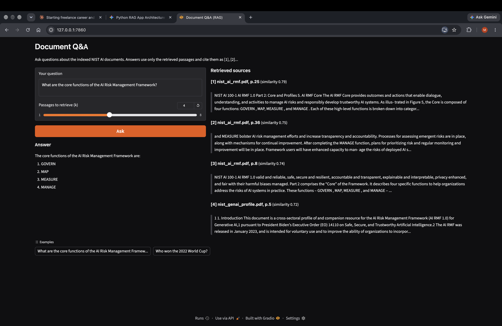
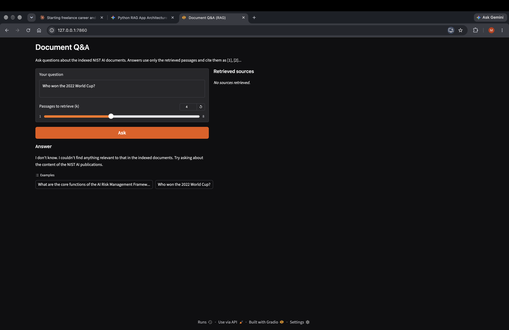
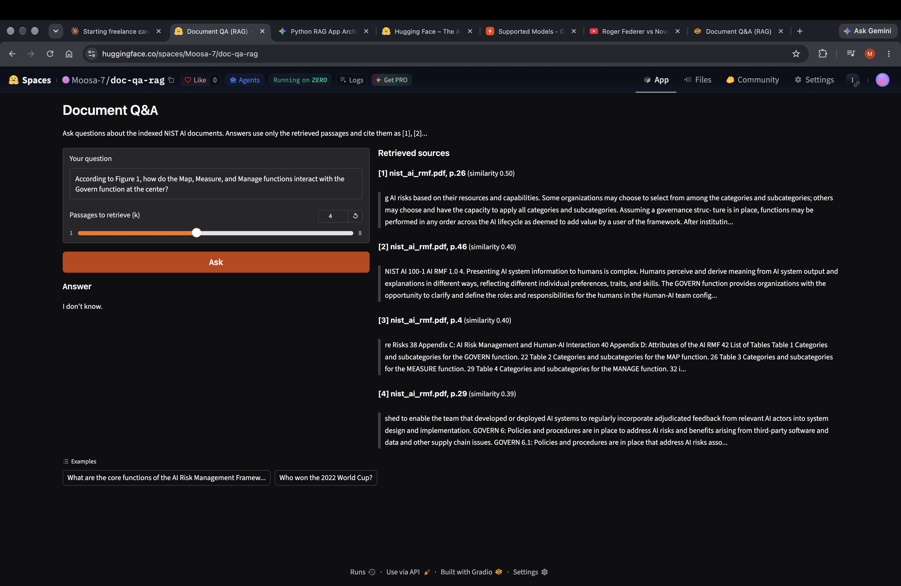
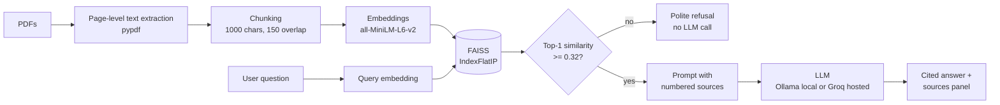

# Document Q&A (RAG) over NIST AI Publications

A retrieval-augmented generation (RAG) app that answers questions about NIST AI publications, **cites its sources**, and **refuses** when nothing relevant is found. Built in plain Python (no LangChain or LlamaIndex) and evaluated on 30 hand-written questions, with the failures documented honestly.

**[Live demo](https://huggingface.co/spaces/Moosa-7/doc-qa-rag)** | Python 3.12 | FAISS | sentence-transformers | Gradio



| Refusal on an off-topic question | A documented limitation |
|---|---|
|  |  |

---

## Contents
1. [What it does](#what-it-does)
2. [How it works](#how-it-works)
3. [Tech stack](#tech-stack)
4. [Evaluation](#evaluation)
5. [Relevance threshold](#relevance-threshold)
6. [Known limitations](#known-limitations)
7. [Repository structure](#repository-structure)
8. [Run it locally](#run-it-locally)
9. [Configuration](#configuration)
10. [Reproduce the evaluation](#reproduce-the-evaluation)
11. [Deployment notes](#deployment-notes)
12. [Engineering notes](#engineering-notes)
13. [Roadmap](#roadmap)
14. [Data, privacy and licence](#data-privacy-and-licence)

---

## What it does

- Answers questions using **only** passages retrieved from a fixed set of NIST AI documents (for example the AI Risk Management Framework, the Generative AI Profile and the adversarial machine learning taxonomy).
- **Cites sources** as `[1]`, `[2]`, and shows each source's document, page number and similarity score, so users can audit what the answer is based on.
- **Refuses** with "I don't know" when the documents don't contain the answer, and short-circuits obviously off-topic input (such as "how are you") **without calling the LLM**.
- Runs fully **offline** with a local model (Ollama), or on a **hosted** model (Groq) for the public demo, switched by one environment variable.

## How it works



### Key design decisions

| Decision | Reason |
|---|---|
| **No RAG framework** | The pipeline is about 150 lines of Python, so every step can be inspected, explained and debugged. |
| **Chunk within each page** | Every chunk has an exact page number for citations. The trade-off is that ideas spanning two pages get split. |
| **1000-character chunks** | all-MiniLM-L6-v2 only reads about the first 256 tokens of its input and silently ignores the rest, so longer chunks would be partly invisible to retrieval. |
| **Normalised embeddings + inner product** | Makes `IndexFlatIP` equivalent to cosine similarity. |
| **Temperature 0** | Repeatable answers, which makes evaluation meaningful. |
| **Prompt-level grounding** | The model is told to answer only from the numbered context, cite bracket numbers, and otherwise reply exactly "I don't know". |
| **Similarity threshold** | Retrieval always returns the top-k chunks even for nonsense queries. A calibrated cutoff avoids wasting an LLM call on them. |
| **Switchable LLM backend** | Develop offline with Ollama, serve the public demo through a hosted API, with no code changes. |

## Tech stack

| Layer | Choice |
|---|---|
| PDF extraction | `pypdf` |
| Embeddings | `sentence-transformers/all-MiniLM-L6-v2` (384-dim) |
| Vector search | FAISS (CPU), `IndexFlatIP` |
| Local LLM | Ollama, `llama3.2:3b` (called with Python's built-in `urllib`, so no extra dependency) |
| Hosted LLM | Groq API, `openai/gpt-oss-20b` (temperature 0, low reasoning effort) |
| UI | Gradio (`gr.Blocks`) |
| Hosting | Hugging Face Spaces (ZeroGPU hardware, see [Deployment notes](#deployment-notes)); index stored via Git LFS/Xet |

## Evaluation

The system was evaluated with a hand-built harness rather than by eyeballing outputs.

**Test set (30 questions, written by me after reading the source pages):**

| Category | Count | Purpose |
|---|---|---|
| direct | 10 | Wording close to the document |
| paraphrase | 8 | Casual wording, to test the vocabulary gap |
| multi_page | 4 | Answer spread across passages |
| figure_table | 3 | Expected to be hard (content inside diagrams) |
| unanswerable | 5 | Includes plausible-sounding questions the documents do not answer |

**Metrics:**
- **Retrieval hit@k:** is a labelled gold page among the top-k retrieved chunks? (25 answerable questions)
- **Answer score:** manual grading against a fixed rubric, 1 = correct, complete and correctly cited; 0.5 = partial or wrong citation; 0 = wrong, invented, or a refusal on an answerable question.
- **False refusals:** answerable questions the model refused.
- **Correct refusals:** unanswerable questions the model refused.

### Baseline results

Configuration: 1000-character chunks, 150 overlap, k = 4, local `llama3.2:3b`.

| Metric | Result |
|---|---|
| Retrieval hit@4 (against my page labels) | **8/25 (32%)** |
| Answer score (manual rubric) | **0.52** |
| False refusals on answerable questions | 10/25 |
| Correct refusals on unanswerable questions | 5/5 |

Retrieval hit@4 by category: direct 5/10, paraphrase 2/8, multi_page 1/4, figure_table 0/3.

*Note: the hosted demo uses `openai/gpt-oss-20b` via Groq, a different (and larger) model than the local `llama3.2:3b` used for these numbers. It has not yet been formally evaluated on this test set.*

### Experiments

One variable changed at a time, retrieval only:

| Run | Change | Hit rate |
|---|---|---|
| base | 1000/150 chars, k = 4 | 8/25 (hit@4) |
| k = 3 | fewer passages | 8/25 (hit@3) |
| k = 6 | more passages | 9/25 (hit@6) |
| c500 | 500/75 chars | 8/25 (hit@4) |
| c1500 | 1500/200 chars | 6/25 (hit@4) |
| norefs | drop bibliography-like chunks | 7/25 (hit@4) |
| bge-small | `BAAI/bge-small-en-v1.5` embeddings | 6/25 (hit@4), paraphrase 0/8 |

**Reading these honestly:** with 25 questions, one question is 4 percentage points. Differences of one or two questions between runs are within noise, so none of these changes produced a measurable improvement. I kept the simplest configuration (MiniLM, 1000/150, k = 4). The only change with a clear mechanism is the 1500-character run, which exceeds the embedding model's 256-token input limit.

### What the failures showed

1. **Text inside diagrams is invisible.** `pypdf` extracts text streams only, so figure content (for example the AI lifecycle diagram) is never indexed.
2. **Vocabulary gap (hypothesis).** Casual phrasing such as "racist or sexist" or "ignores a deployed model" failed to land near the documents' formal terms ("harmful bias", "drift"). Not yet tested by rewriting queries.
3. **Bibliography chunks pollute results.** Reference-list chunks full of URLs embed as generic text and surface for loosely matching queries. A crude filter did not measurably help.
4. **Possible label problems.** Several near-verbatim questions retrieved content with high similarity yet counted as misses (the highest-scoring "miss" had similarity 0.78). My page labels may use printed page numbers rather than PDF page indexes, or the same passage may appear in several documents. A label audit is still pending, so the 32% figure is a retrieval hit rate **against my labels**, not a measure of true accuracy.

## Relevance threshold

Without a cutoff, a question like "how are you" still returned four unrelated passages and spent an LLM call on them. I calibrated a cutoff on the evaluation set:

| Group | Top-1 similarity |
|---|---|
| Junk and off-topic probes ("how are you", "hello", "asdf", recipes, weather) | 0.13 to 0.28 |
| Lowest-scoring genuine question in the test set | 0.36 |
| **Chosen cutoff (`MIN_SCORE`)** | **0.32** |

Queries scoring below it get a polite refusal and an empty sources panel, with no LLM call. **This only catches obvious junk.** Plausible but unanswerable questions (such as a specific financial penalty, or which framework a document recommends) scored 0.53 to 0.64, above many genuine questions, so similarity cannot reject them and the model's own refusal has to. The cutoff was calibrated on a small sample and should be re-checked if the corpus changes.

## Known limitations

- **No OCR or vision.** Diagrams, figures and some tables are not searchable.
- **Retrieval is weak on paraphrased questions** (2/8 in the baseline) because of the small embedding model and the vocabulary gap.
- **The threshold does not stop plausible out-of-scope questions.**
- **Evaluation is small (25 answerable + 5 unanswerable) and labels are unaudited.** Treat the numbers as indicative, not definitive.
- **Local and hosted models differ.** The reported answer scores come from local `llama3.2:3b`. The public demo uses a different model, which has not been formally evaluated.
- **Answer grading is manual** and was done by one person.
- **Free-tier hosting** means rate limits and cold starts.

## Repository structure

```text
doc-qa-rag/
├── app.py                  # Gradio UI
├── src/
│   ├── config.py           # paths and settings (env-driven)
│   ├── ingest.py           # PDF -> page text -> chunks (data/chunks.jsonl)
│   ├── index.py            # chunks -> embeddings -> FAISS index
│   ├── retrieve.py         # Retriever class + CLI
│   ├── generate.py         # prompt, LLM backends, relevance threshold
│   ├── eval_retrieval.py   # hit@k evaluation
│   ├── eval_answers.py     # answer CSV generation + score summary
│   └── score_stats.py      # similarity-score calibration for MIN_SCORE
├── eval/
│   ├── questions.jsonl     # 30 labelled test questions
│   ├── results.md          # experiment log
│   └── results/            # per-run outputs
├── docs/                   # screenshots
├── data/pdfs/              # source PDFs (not committed, see Data)
├── requirements-dev.txt    # full local environment
├── requirements-space.txt  # minimal deployment dependencies
├── SPACE_README.md         # Hugging Face Space config header
└── deploy_space.sh         # copies deployable files to the Space repo
```

## Run it locally

Requires Python 3.12 and, for the offline backend, [Ollama](https://ollama.com).

```bash
git clone https://github.com/Moosa-7/doc-qa-rag.git
cd doc-qa-rag
python3.12 -m venv .venv && source .venv/bin/activate
pip install -r requirements-dev.txt

# 1. Add the NIST PDFs to data/pdfs/ (see "Data, privacy and licence")
# 2. Build the chunks and the index
python -m src.ingest
python -m src.index

# 3. Start the local LLM (separate terminal)
ollama pull llama3.2:3b
ollama serve

# 4. Launch the app
python app.py
```

Ask from the command line instead of the UI:

```bash
python -m src.generate "What is data poisoning?"
```

**Use the hosted backend locally:**

```bash
pip install groq
export LLM_BACKEND=groq
export GROQ_API_KEY="your-key"      # never commit this
python app.py
```

## Configuration

All settings are environment variables with sensible defaults.

| Variable | Default | Purpose |
|---|---|---|
| `LLM_BACKEND` | `ollama` | `ollama` (local) or `groq` (hosted) |
| `GROQ_API_KEY` | none | Required for the Groq backend |
| `GROQ_MODEL` | `openai/gpt-oss-20b` | Hosted model; Groq retires models over time, so check their model list |
| `OLLAMA_MODEL` | `llama3.2:3b` | Local model |
| `MIN_SCORE` | `0.32` | Relevance cutoff; `0` disables it |
| `CHUNK_SIZE` / `CHUNK_OVERLAP` | `1000` / `150` | Chunking, in characters |
| `EMBED_MODEL` | `sentence-transformers/all-MiniLM-L6-v2` | Embedding model |
| `QUERY_PREFIX` | empty | Query prefix for models that expect one (for example BGE) |
| `FILTER_REFS` | `0` | `1` drops bibliography-like chunks during ingestion |
| `RUN_TAG` | empty | Writes chunks and index to separate paths for experiments |

## Reproduce the evaluation

```bash
# Retrieval hit rate at several k, broken down by question category
python -m src.eval_retrieval

# Generate answers to a CSV, grade the 'grade' column by hand, then summarise
python -m src.eval_answers run 4
python -m src.eval_answers summarize 4

# Calibrate the similarity cutoff
python -m src.score_stats
```

Run an experiment (separate chunks and index per tag):

```bash
export RUN_TAG=c500 CHUNK_SIZE=500 CHUNK_OVERLAP=75
python -m src.ingest && python -m src.index && python -m src.eval_retrieval
unset RUN_TAG CHUNK_SIZE CHUNK_OVERLAP
```

Question format (`eval/questions.jsonl`, one object per line; `page` is the PDF page index, not the printed number):

```json
{"id": 1, "category": "direct", "question": "...", "answerable": true,
 "gold_answer": "...", "gold": [{"source": "nist_ai_rmf.pdf", "page": 24}]}
```

## Deployment notes

The public demo runs on a Hugging Face Space. Deployment surfaced several platform-specific issues worth recording:

- **Hardware.** New free accounts can no longer create CPU Basic Gradio Spaces, so the Space runs on ZeroGPU hardware. The app never uses a GPU. It contains a no-op `@spaces.GPU` function (required by ZeroGPU) that is never called, and `spaces` is imported before any torch-related package.
- **CPU embeddings on the Space.** When the `SPACE_ID` environment variable is present, the embedding model is forced onto the CPU and FAISS runs single-threaded. Locally the default device is used.
- **Binary files.** Hugging Face rejects raw binary files such as the FAISS index. They are stored via Git LFS/Xet (`git lfs track "*.index"`).
- **Python version.** The Space defaults to Python 3.10, so `python_version: 3.12` is set in its README header to match the pinned dependencies.
- **Secrets.** The Groq key lives in the Space's secrets and `LLM_BACKEND=groq` is a Space variable. Nothing sensitive is committed.
- **Packaging.** `deploy_space.sh` copies only what the app needs (code, chunks, prebuilt index and a minimal requirements file) into a separate Space repository.

## Engineering notes

- **Index-time truncation:** the embedding model's 256-token limit drove the chunk-size choice, and the 1500-character experiment was the one run that clearly lost.
- **Threshold side effects:** because every real question in the test set scored above the cutoff, adding it did not change any evaluated answer.
- **Environment hygiene:** experiments are isolated with `RUN_TAG` so a stray environment variable can never silently change which index is loaded.
- **macOS crash:** forcing CPU embeddings unconditionally caused a segmentation fault on Apple silicon (a threading-library clash), which is why the CPU override applies only on the Space.
- **Failure handling:** the LLM call is wrapped so API errors, rate limits or a missing local server show a readable message instead of crashing the UI. Input is capped at 500 characters.

## Roadmap

1. **Audit the labels** (printed versus PDF page numbers, duplicate passages) and re-run all experiments.
2. **Evaluate the hosted model** on the same 30 questions and compare it with the local model.
3. **Fix the vocabulary gap:** test LLM-based query rewriting and hybrid retrieval (BM25 + embeddings).
4. **Handle figures:** OCR or a vision-language model for diagrams, with multimodal chunking.
5. **Larger, double-labelled test set** and a validated automated grader to replace manual scoring.
6. **Reranking** of the top results with a cross-encoder.

## Data, privacy and licence

- **Data.** The NIST publications are not included in this repository. Download them from [nist.gov](https://www.nist.gov) and place them in `data/pdfs/`. Check each document's terms of use before redistributing anything derived from it.
- **Privacy.** In the hosted demo, the question text and the retrieved passages are sent to Groq's API. Don't enter sensitive information. The local backend sends nothing off the machine (apart from the one-time model downloads).
- **Licence.** Code released under the [MIT License](LICENSE).

---

Built by **Muhammad Moosa** ([GitHub](https://github.com/Moosa-7) | [LinkedIn](https://www.linkedin.com/in/mmoosa7/)).